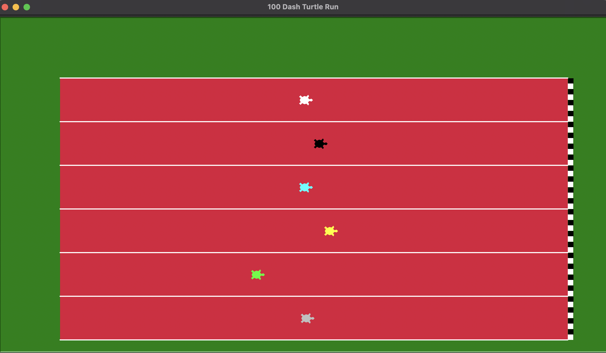

# 🐢 Turtle 100 Dash Run

A colorful, dynamic turtle racing game built with Python's `turtle` module. Pick your favorite turtle, place your bet, and watch the race unfold on custom-designed crimson tracks with a bold finish line!



## 📁 Project Structure

```

TurtleRaceAdvance/
│
├── 1.png              # Screenshot or race illustration
├── turtle\_race.py     # Main turtle racing game code
└── **init**.py        # (optional) to treat this folder as a package
README.md              # You're reading it!

````

## 🎮 Game Features

- 6-lane **crimson track** with white borders
- **Black & white finish line** drawn without gaps
- Player betting system
- Random turtle speeds for unpredictable races
- Win/loss result based on your chosen turtle

## 🧠 How to Play

1. Run the game:
   ```bash
   python TurtleRaceAdvance/turtle_race.py
````

2. A prompt will appear asking:

   ```
   Which Turtle Will Win The Race
   ```

   Choose a color from: `white`, `black`, `cyan`, `yellow`, `lime`, or `silver`.

3. Watch the race unfold!

4. The game will display whether you **won or lost** based on your choice.

## 🎨 Turtle Colors and Positions

| Color  | Lane       |
| ------ | ---------- |
| white  | 1 (top)    |
| black  | 2          |
| cyan   | 3          |
| yellow | 4          |
| lime   | 5          |
| silver | 6 (bottom) |

## 🛠 Requirements

* Python 3.x
* Standard `turtle` module (comes with Python)

## 📸 Screenshot

Included image `1.png` shows the race in action!

---

Enjoy the race and may your turtle be swift! 🐢💨

```
